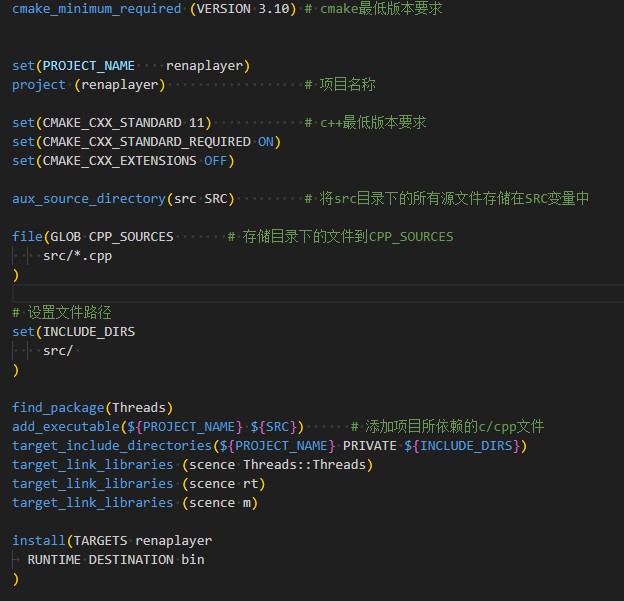

### CMAKE
  

## aux_source_directory(dir var)

## include_directories ( dir )
  自动去dir路径下查找头文件
  gcc -l dir

### 生成动态库和静态库
  

## $ PROJECT_BINARY_DIR
  cmake系统变量，执行cmake命令的地址 如果在build目录下执行 则为build目录
## add_library(lib_name STATIC/SHARED src)
  生成库
  lib_name: 库名
  STATIC/SHARED: 静态/动态库
  src : 库生成所需的文件 指源文件
## set_target_properties()
  重新定义库名称
## $ LIBRARY_OUTPUT_PATH
  cmake系统变量，生成的库文件都在这个目录下

### 链接库文件
## $ EXECUTABLE_OUTPUT_PATH
  cmake系统变量，生成的可执行文件夹目录
  
## find_library(var lib_name lib_path1 lib_path2)
  查找库 并 存储到变量var
## target_link_libraries(target lib_name)
  链接库到可执行文件中

### 交叉编译
set(CMAKE_SYSTEM_NAME Linux)
set(CMAKE_SYSTEM_PROCESSOR arm)

set(tools /home/z/nfs/gcc-linaro-7.3.1-2018.05-x86_64_arm-linux-gnueabihf/bin)
set(CMAKE_C_COMPILER ${tools}/arm-linux-gnueabihf-gcc)
set(CMAKE_CXX_COMPILER  ${tools}/arm-linux-gnueabihf-g++)

重新设置c c++的编译器为交叉编译器

### 添加全局宏定义
`add_definitions(-Dxxxx)`